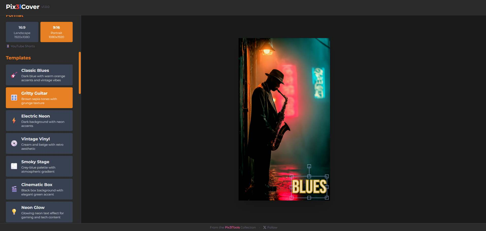

# Pix3lCover

A professional web application to create stunning YouTube thumbnails for videos and shorts in under 5 minutes.

**From the [Pix3lTools](https://www.pix3ltools.com/) Collection** - Professional tools for content creators.



[](https://www.youtube.com/watch?v=aj5Eh3BlGY8)

## Features

### Implemented (Working)

- **Image Upload**: Drag & drop, file upload, or paste from clipboard (Ctrl+V)
- **Video Frame Extraction**: Upload a video (MP4, WebM, MOV) and extract any frame as thumbnail background
- **Dual Format Support**: 16:9 landscape (1920x1080) and 9:16 portrait (1080x1920) for YouTube Shorts
- **14 Professional Templates**: Including Neon Glow, Minimal Clean, Vintage Film, Bold Impact, Gradient Fade, Split Screen, Corner Badge, and Polaroid
- **Text Editing**: Title and subtitle with customizable fonts, colors, and effects
- **Font Selector**: Choose from 23 Google Fonts (including luxury fonts: EB Garamond, Bodoni Moda, Cormorant, DM Serif Display) with size controls
- **Color Picker**: Custom color selection for title and subtitle text with preset colors
- **Interactive Canvas**: Drag and resize elements, format-aware positioning with persistent positions
- **AI Generated Badge**: 4 styles, transparent or custom background, smart positioning across formats
- **Project Gallery**: Visual gallery with thumbnails, grid/list view, search, and format filters
- **Export System**: Download as JPG (80-100% quality) or PNG with Full HD resolution
- **Auto-save**: Automatic project saving every 30 seconds with restore on load
- **Storage Warning**: Dismissible banner informing users about localStorage limitations
- **Pix3lTools Branding**: Header link to the Pix3lTools website

### Planned (Not Yet Implemented)
- Undo/Redo: History stack for changes
- Keyboard Shortcuts: Speed up workflow

## Tech Stack

- **Frontend**: React 18 + Vite 6
- **Styling**: Tailwind CSS 3.4
- **Canvas**: Fabric.js 5.3
- **Fonts**: Google Fonts (23 total)
- **Storage**: LocalStorage (project persistence)
- **Deployment**: Vercel

## Getting Started

### Installation

```bash
npm install
```

### Development

```bash
npm run dev
```

Open [http://localhost:3010](http://localhost:3010) to view it in your browser.

### Build

```bash
npm run build
```

### Preview Production Build

```bash
npm run preview
```

## How to Use

1. **Start the dev server**: `npm run dev`
2. **Choose format**: Select 16:9 (landscape) or 9:16 (portrait/Shorts)
3. **Upload an image**: Drag & drop, click to browse, or paste (Ctrl+V)
4. **Select a template**: Choose from 14 professional designs
5. **Add text**: Enter title (auto-uppercase) and optional subtitle
6. **Customize fonts**: Choose from 23 Google Fonts with size controls
7. **Customize colors**: Use color picker for custom title/subtitle colors
8. **Position elements**: Drag text and badge to desired positions (positions are saved!)
9. **Save project**: Name and save your project (auto-saves every 30 seconds)
10. **Export**: Choose format (JPG/PNG), adjust quality, and download at Full HD resolution

### Tips
- Use JPG format for smaller file sizes (recommended for YouTube)
- Quality 90% is optimal balance between size and quality
- Projects auto-save every 30 seconds - look for the indicator in the header
- Use the Project Gallery to browse saved projects with visual thumbnails
- Filter projects by format (16:9 / 9:16) or search by name
- Canvas elements are fully interactive - click and drag to reposition

## Project Structure

```
src/
├── components/         # React components
│   ├── Canvas/        # Canvas-related components
│   │   └── ThumbnailCanvas.jsx  # Main Fabric.js canvas
│   ├── Sidebar/       # Sidebar panels
│   │   ├── UploadPanel.jsx      # Image upload
│   │   ├── TemplateSelector.jsx # Template selection
│   │   ├── FontSelector.jsx     # Font customization
│   │   ├── TextColorPicker.jsx  # Text color picker
│   │   ├── BadgeEditor.jsx      # AI badge editor
│   │   ├── ProjectGallery.jsx   # Project gallery with thumbnails
│   │   └── ExportPanel.jsx      # Export settings
│   ├── StorageWarning.jsx       # localStorage warning banner
│   └── AutoSaveIndicator.jsx    # Auto-save status indicator
├── hooks/             # Custom React hooks
│   └── useAutoSave.js # Auto-save functionality
├── utils/             # Utility functions
│   ├── exportUtils.js # Export canvas to image
│   └── storageUtils.js# localStorage management
├── data/              # Static data
│   ├── templates.js   # 14 thumbnail templates
│   ├── fonts.js       # 23 Google Fonts
│   └── badgeStyles.js # Badge style definitions
├── styles/            # Global styles
├── App.jsx            # Main app component
└── main.jsx           # Entry point
```

## License

MIT License - See [LICENSE](LICENSE) file for details.

## Author

**[Pix3lTools](https://www.pix3ltools.com/)** - Professional tools for content creators.

- Website: [pix3ltools.com](https://www.pix3ltools.com/)
- GitHub: [github.com/Pix3ltools-lab](https://github.com/Pix3ltools-lab)
